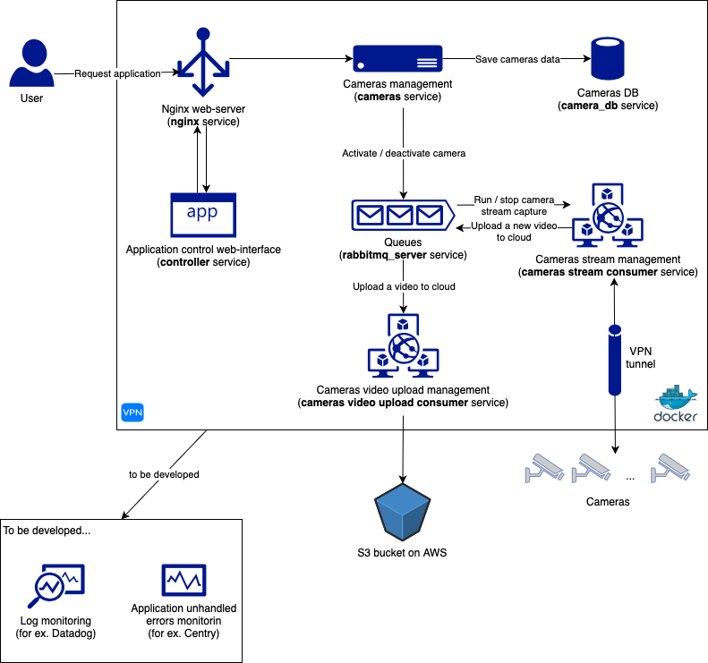
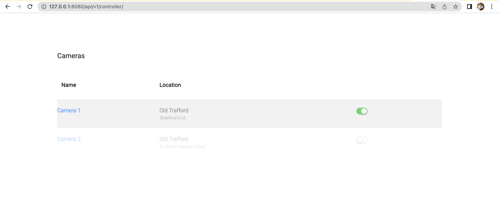

# Observer
> Big brother is watching you

Observer is an application developed to record video stream from cameras and save the streams somewhere in a cloud. The application also provide an web-interface to manage cameras easily.

## Schema

- SVG version:



- PNG version:



## User interface to manage cameras



## Microservices

1. `controller` service - the service is responsible for communication between users and cameras. It provides a simple web-interface based on `FastApi` to turn on/off cameras, check its state, etc.
2. `cameras` service - the service is responsible for cameras management and save its states to the DB. The service communicate with another services using RESTApi(`controller` service) and RabbitMq(`cameras-stream-consumer` service). When a user from `controller` service requests to turn on/off a camera the service updates the camera state in the DB and sends a message to a `cameras-stream-consumer` service queue.
3. `cameras-stream-consumer` service - the service is responsible to capture the stream from cameras. The service communicate with `cameras` service and `cameras_video_upload_consumer` service using RabbitMq. When the service gets a message from `cameras` service it starts/stops capturing a stream from a camera. While a stream is active the service split sthe stream to a short video files(about 10 sec but might be configured) and sends messages to `cameras_video_upload_consumer` service to upload files to a cloud.
4. `cameras_video_upload_consumer` service - the service is responsible to upload stream video files to a cloud. The service communicate with `cameras_video_upload_consumer` service using RabbitMq. When the service gets a message from the queue with a new video file path it tryes to upload the video to AWS S3 cloud. If upload is faild because of S3 issues it tries to re-send the upload message to the queue aging. If 3 tries of uploading is faild - it logs an error.
5. `cameras_db` service - PostrgeSQL database for `cameras` service
6. `nginx` service - Nginx service to manage http-requests to `controller` service and `cameras` service.
7. `rabbitmq_server` service - queue service to allow messages communications between `cameras` service, `cameras-stream-consumer` service and `cameras_video_upload_consumer` service.

## Docker

Observer app is very easy to install and deploy in Docker containers.

By default, the Docker will expose port 8080 in `nginx` container, so change this within the
docker-compose.yml file if necessary. When ready, simply use a command below to
build and run images.

```sh
cd observer
`docker-compose up -d`
```

This will create observer app images and pull in the necessary dependencies.

Once done, verify the deployment by navigating to your server address in
your preferred browser.

```sh
127.0.0.1:8080/api/v1/controller
```

** you can use test data from _dumps folder - just import _dumps/dump.sql to the container DB.
